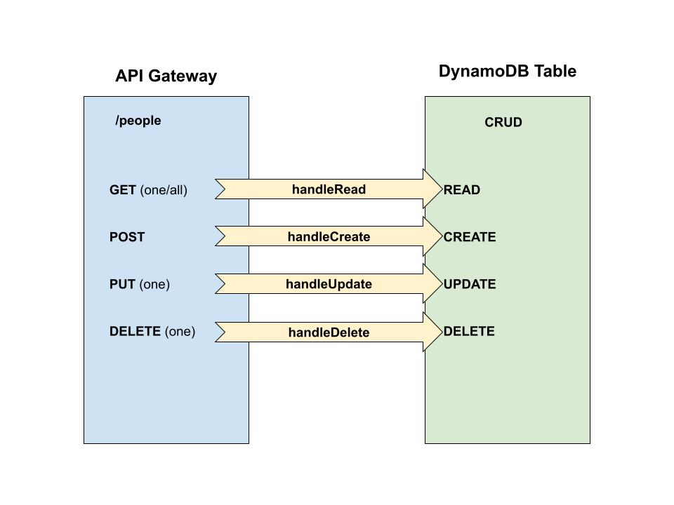

# LAB - CLASS 17

## Project: AWS S3 and Lambda

## Author: Kenny W. Lino

## Problem Domain

In this lab, we work with AWS DynamoDB, the NoSQL storage service and AWS Lambda to set up functions that trigger CRUD functions via our AWS API Gateway. We create a basic schema outlining some information about people including 'name' and 'phone' and use Dynamoose, an npm package used for DynamoDB that is very similar to Mongoose for MongoDB.

### Links and Resources

- [Deployed API Gateway](https://kgw343xi57.execute-api.us-west-2.amazonaws.com/production/people)

### Deployment Process

In order to get started, we first need to set up our DynamoDB instance. In this case, we named the table 'people' and we defined our partition key, which we set to 'id' before pushing 'Create table'.

After that, we started setting up our AWS Gateway API where we defined an endpoint `/people` and began adding functionality for each REST verb. For each one, we created a lambda function such as 'handleCreate', and connected them to the appropriate REST verb. 

To set up the lambda function, we need to set up an npm package locally via `npm init -y` and then we installed `dynamoose` and added a start script `node index.js` for good measure. We then zipped these items and uploaded them via the AWS Lambda GUI. From there, we manipulated the data coming in via the `event` property by grabbing things like the body and wrote the appropriate functionality from `dynamoose` to manipulate our `people` DynamoDB database.

### Features / Routes

#### Routes

- `/` <-X- **NO** root endpoint; use `/people` for testing
- `/people` 
    - GET all people -- returns an array of all the records
    - POST a new person -- returns an object containing the single record
- `/people/{id}`
    - GET a single person with {id} -- returns an object containing the single record
    - PUT new data for a single person with {id} -- returns an object containing the single *updated* record
    - DELETE a person with {id} -- returns an empty object

#### Lambdas

The following lambdas are triggered based on what REST function is called from the API Gateway.

- `handleCreate`  -- POST the new person
- `handleRead` -- GET all people / GET one person 
- `handleDelete` -- DELETE one person 
- `handleUpdate` -- PUT one person

## UML

